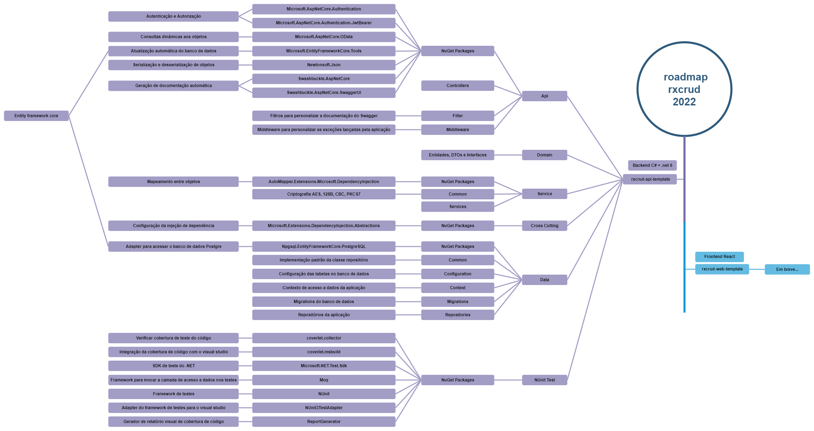

  
  <h1 align="center">Roadmap rxcrud 2022</h1>

## :dart: O roadmap das tecnologias utilizadas na rxcrud

Abaixo você encontra, de forma visual, os caminhos que você pode tomar para estudar as tecnologias e arquiteturas utilizadas nos projetos da rxcrud

## ⚠️ Licença
`roadmap` esta licenciado sob a [MIT License](https://github.com/rxcrud/roadmap/blob/main/LICENSE).